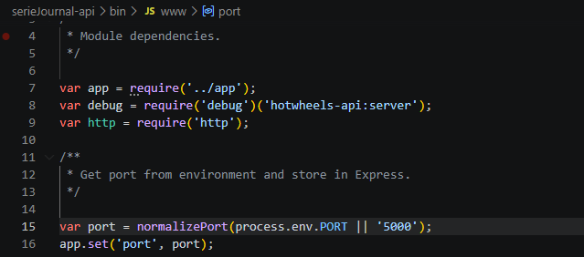
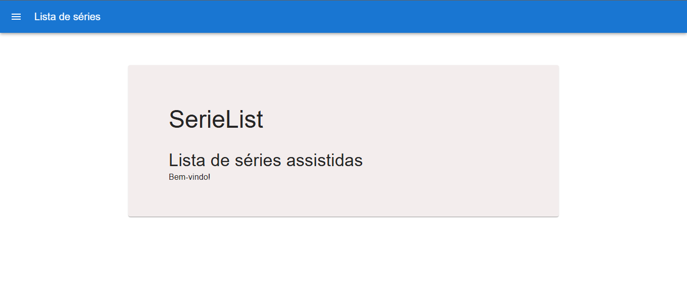
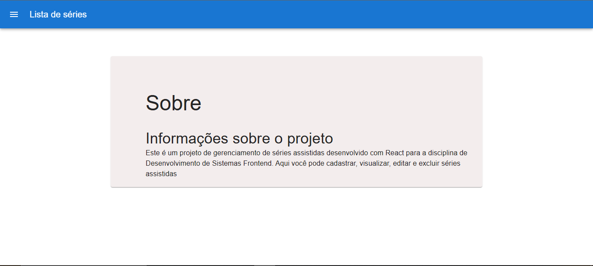
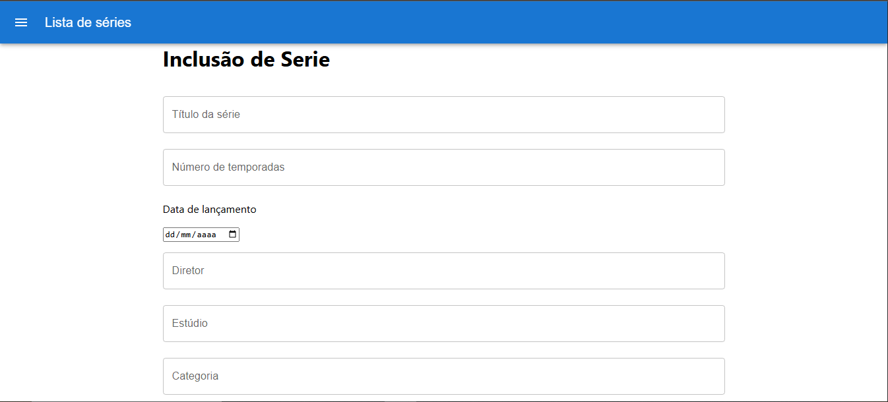
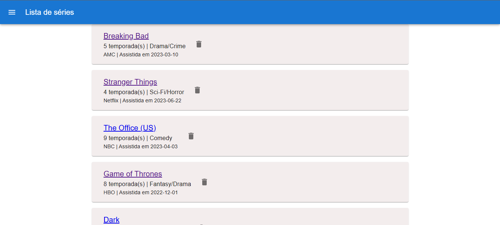
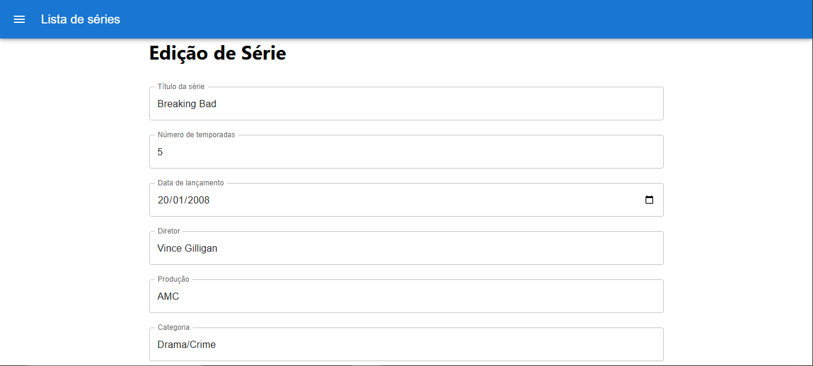

# Cadastro de Séries
### Nome: Benjamin Chiappini

Primeiramente, na API vá para a pasta bin e certifique-se que a porta é '5000'.

    No diretório do projeto, abra dois terminais, abrindo a api em um, e o projeto react em outro. Após isso, rode nos dois terminais os comandos:

### `npm install`

    Para instalar todas as dependências do projeto.

### e `npm start`

    Para inicializar o projeto.

    Após a execução, este deverá ser o resultado no seu navegador:

# Introdução

O projeto permite o cadastro de séries, com seus respectivos dados por meio de um formulário, além da exclusão e a edição de seus cadastros.
Foi codificado usando ReactJS, utilizando os conhecimentos aprendidos nas aulas da disciplina de Desenvolvimento de Sistemas Frontend.

# Componentes (de cima para baixo)

### App.js

Componente principal do projeto, roda todos os outros.

### Navigation.jsx

Controla a exibição e funcionamento da barra de navegação que fica no lado esquerdo da tela

### SerieAdd.jsx 

Responsável por adicionar séries a lista

### SerieEdit.jsx

Responsável por editar informações de séries

### useSerieApi.jsx

Consome os dados e faz requisições HTTP para a API que está na porta 5000

### About.jsx

Página que conta com informações sobre o projeto, acessada pela rota /about com link disponível na barra de navegação como 'Sobre'

### AddSerie.jsx

Exibe um formulário para cadastrar um série nova, fica na rota /addserie e seu link na barra é 'Inclusão de séries'  

### Home.jsx

Tela inicial do site

### Home.test.js

Testa se tela inicial foi renderizada corretamente

### ListSerie.js

Exibe lista de séries para o usuário, está na rota /list e seu link é 'Lista de séries'

### Serie

Tela de edição de dados de série, está na rota /serie/idDaSerie e é acessada ao clicar nome de alguma série 

### Testes Cypress

Para rodar os testes cypress, abra um terminal, vá para o diretório serie-colection, e rode `npx cypress open` Após isso, selecione E2E Testing e escolha o navegador de preferência. Você poderá ver os testes automatizados de listagem de séries, inclusão e exclusão.

